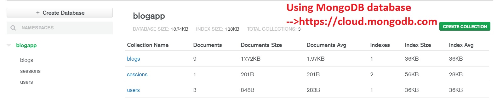

# BlogApp

> Create blogs

## Demo
[]

## Database
[]

## Technology
This app uses Node.js/Express/MongoDB/Passport.js with Google OAuth for authentication

## Usage

Add your mongoDB URI and Google OAuth credentials to the config.env file

```
# Install dependencies
npm install

# Run in development
npm run dev

# Run in production
npm start
```
@http://projects.adsingh.net/


